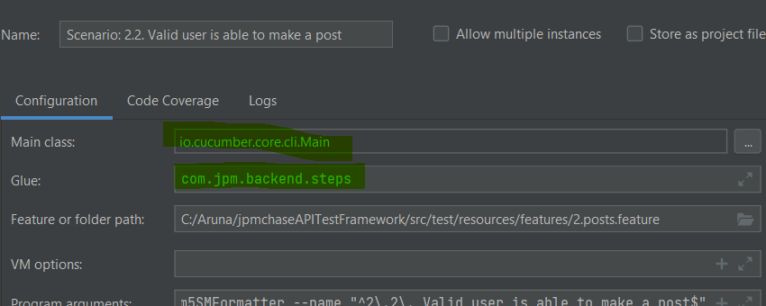

**Project Title**

    jpmchase API Test Framework 

**Project Description**

    Test Framework to validate various test scenarios for REST endpoints of https://jsonplaceholder.typicode.com/

**How to Run the Project**

    Edit configuration to provide below details 
    

    a. To run a single scenario,goto the feature file and click on the green arrow
    b. To run all scenarios in a feature file,right click on the feature file in the Project pane and choose the option Run 'Feature: XXXX'
    c. To run all feature files,right click on CucumberRunnerIT in the Project pane and choose the option 'Run CucumberRunnerIT'
    d. To run from the command prompt, use the maven command _'mvn clean install'_
    e. To run from the command prompt for certain tags, use the maven command 'mvn clean verify "_-Dcucumber.options=--tags @smoke --glue com.jpm.backend.steps"_'

**How to use the Project**
    
    a. To understand the framework, step through few scenarios and understand the codeflow
    b. Create a new feature file for every new endpoint
    c. Add API related common methods to APIServices java class
    d. For new methods of existing endpoints, amend the feature files and add new scenarios
    e. For adding/amending scenarios/common methods/services
        (i) Create a branch for any new work 
        (ii) Run all the tests and ensure they Pass
        (ii) Raise a PR  and merge to master

